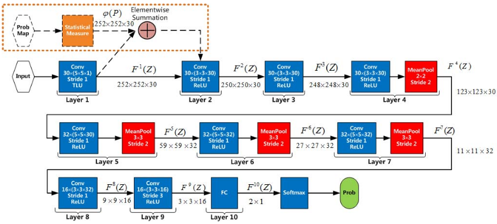

# Deep Learning Hierarchical Representation for Image Steganalysis (YeNet) Pytorch Implementation:

The model is trained on the S-Uniward 0.5bpp in the same setting as reported in the paper:
"[Deep Learning Hierarchical Representation for Image Steganalysis](https://ieeexplore.ieee.org/stamp/stamp.jsp?tp=&arnumber=7937836)".

Training and testing code will be made available soon.
<table>
  <tr>
    <td align="center">YeNet Architecture</td>
  </tr>
  <tr>
    <td valign="top"></td>
  </tr>
 </table>

